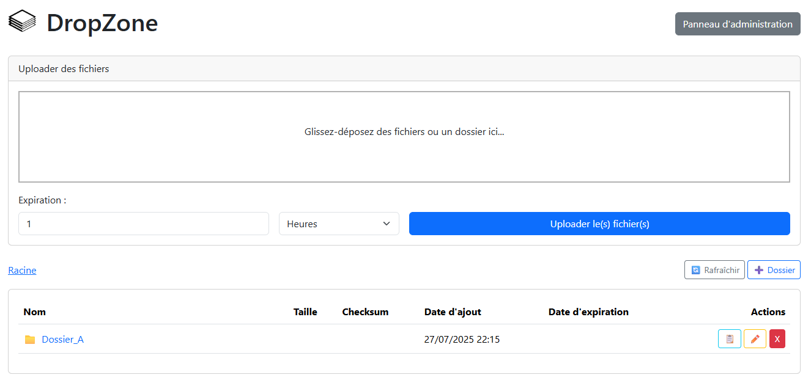

# DropZone

[](https://www.gnu.org/licenses/gpl-3.0)

Une application web simple et efficace pour gérer des fichiers et des dossiers sur votre système local via une interface moderne.




## ✨ Fonctionnalités

- **Gestion hiérarchique :** Créez, renommez, et supprimez des dossiers et sous-dossiers.
- **Navigation intuitive :** Naviguez dans l'arborescence avec un fil d'Ariane dynamique.
- **Gestion de fichiers :** Affichez les fichiers avec leur nom, taille, checksum (SHA256) et dates.
- **Actions rapides :** Renommez, supprimez, copiez l'URL de téléchargement direct pour chaque fichier et l'URL de partage pour les dossiers.
- **Uploads robustes :**
    - Zone de glisser-déposer (drag-and-drop) pour les fichiers et les dossiers.
    - Uploads fractionnés ("chunked") pour gérer les très gros fichiers et les connexions instables.
    - Barre de progression avec affichage du pourcentage.
- **Expiration automatique :**
    - Définissez une durée d'expiration (en minutes, heures, ou jours) pour chaque upload.
    - Les fichiers expirés sont supprimés automatiquement par une tâche de fond.
- **Panneau d'administration :**
    - Sécurisé par mot de passe.
    - Configurez la taille maximale des uploads, la taille des morceaux, et les durées d'expiration (par défaut et maximale).
    - Purgez tous les fichiers ou les logs.
    - Consultez les logs d'activité.
- **Performances :**
    - Les opérations longues (assemblage de fichiers, calcul de checksum) sont gérées en arrière-plan par Celery pour ne jamais bloquer l'interface.
    - L'assemblage et le calcul du checksum sont combinés en une seule passe pour optimiser les accès disque.
- **Thème adaptatif :** L'interface bascule automatiquement entre le mode clair et sombre selon les préférences de votre système.
- **Conteneurisé :** L'ensemble de l'application (serveur web, workers, scheduler) est géré par Docker pour une installation et un déploiement faciles.

## 🛠️ Stack Technique

- **Backend :** Python, Flask, Celery
- **Frontend :** Bootstrap 5, Dropzone.js, JavaScript
- **Base de données :** SQLAlchemy (avec SQLite par défaut)
- **Infrastructure :** Docker, Docker Compose, Redis (pour Celery), Gunicorn

## 🚀 Installation et Lancement

### Prérequis

- [Docker](https://www.docker.com/get-started)
- [Docker Compose](https://docs.docker.com/compose/install/)

### Étapes d'installation

1.  **Clonez le projet :**
    ```bash
    git clone https://github.com/ClementLG/dropzone.git
    cd dropzone
    ```

2.  **Configurez l'environnement :**
    Créez un fichier nommé `.env` à la racine du projet et ajoutez la configuration suivante.

    ```
    # Fichier: .env
    SECRET_KEY=une-super-cle-secrete-a-changer
    ADMIN_PASSWORD=votre_mot_de_passe_admin_ici
    ```

3.  **Lancez l'application avec Docker Compose :**
    Cette commande va construire les images et démarrer tous les services.
    ```bash
    docker-compose up --build -d
    ```

4.  **Accédez à l'application :**
    - L'interface principale : `http://localhost:5000`
    - Le panneau d'administration : `http://localhost:5000/admin`

## 📁 Structure du Projet

```
/dropzone_project/
├── app/
│   ├── __init__.py
│   ├── models.py
│   ├── tasks.py
│   ├── routes/
│   ├── templates/
│   └── static/
├── config.py
├── run.py
├── .env
├── config.json
├── Dockerfile
├── docker-compose.yml
└── requirements.txt
```

## 📄 Licence

Ce projet est sous licence GPLv3. Pour plus de détails, consultez le lien suivant : [https://www.gnu.org/licenses/gpl-3.0.html](https://www.gnu.org/licenses/gpl-3.0.html).